# aDIPters
This is a collection of different adapter PCBs to plug SMT parts into DIP sockets, and/or to use a writable part in place of an originally read-only part.
Generally to use a newer PLCC, SOIC, or TSOP EEPROM or Flash part to replace a DIP mask ROM or UV EPROM in a vintage computer.

## 28C256_to_27C256
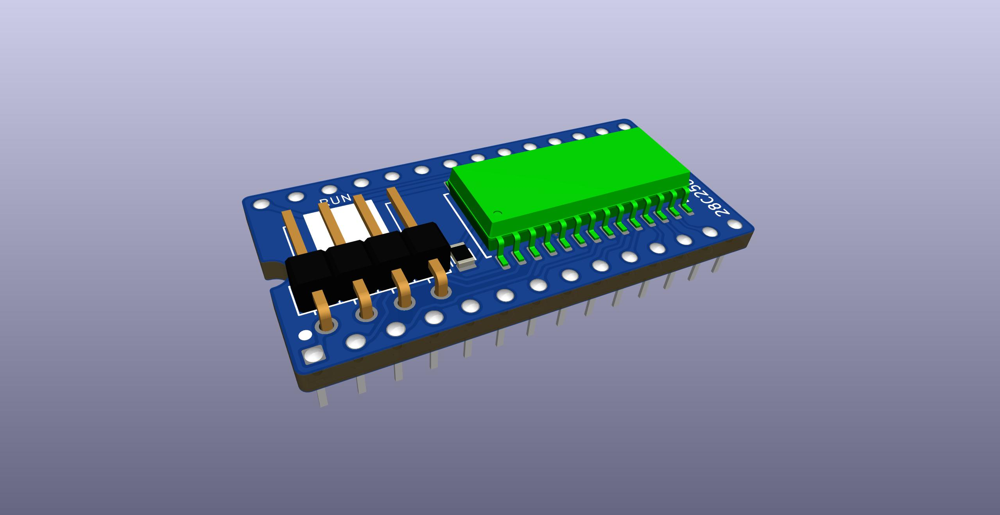  
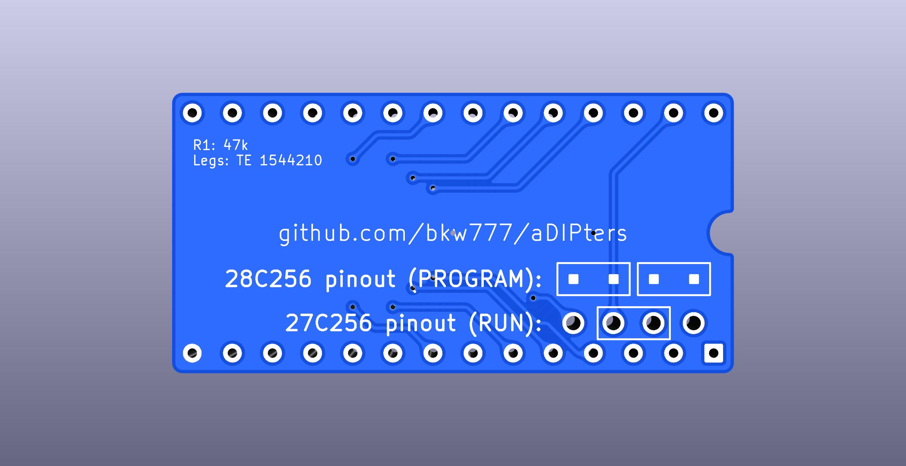  
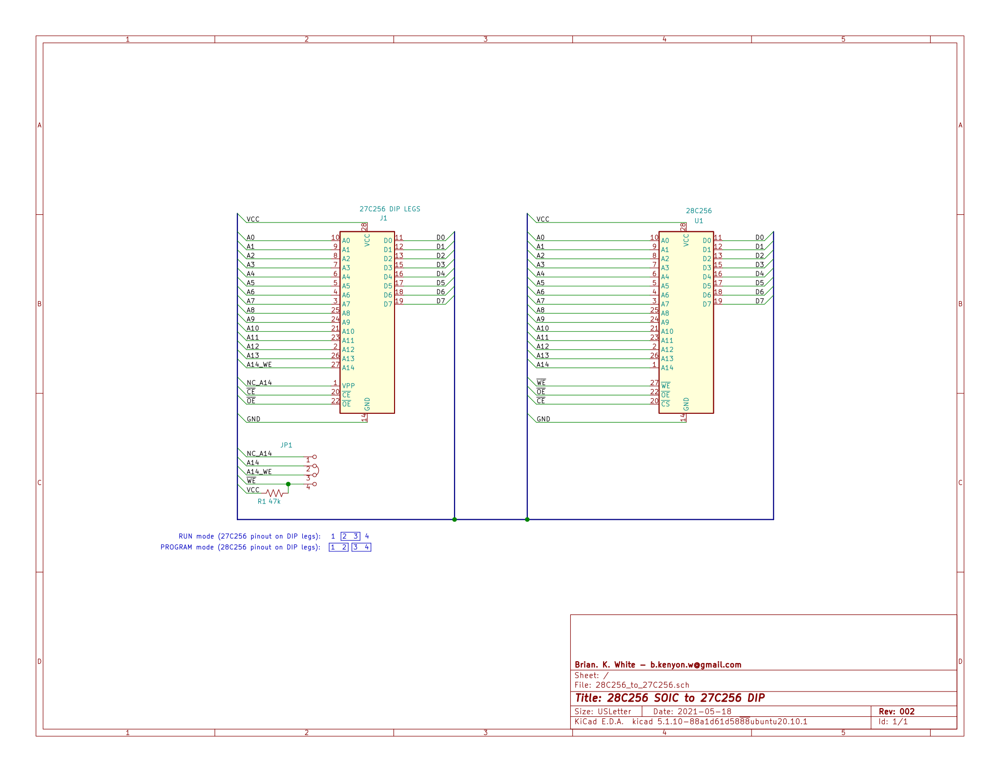

http://tandy.wiki/28C256_to_27C256

Use an electrically re-programmable EEPROM (28C256) in any socket that normally takes a 256K x 8 UV EPROM (27C256) or standard pinout mask ROM.

Since this board goes into a very standard socket and replaces a very standard pinout chip, there are countless places it may be used, but here are just a few:

 Tandy Model 102 system rom  
 Tandy Model 200 system rom  
 Tandy Model 600 system roms  
 NEC PC-8201 system and option roms  
 NEC PC-8300 option rom  
 Olivetti M10 system and option roms  
 Kyotronic KC-85 system and option roms  

The chip may be programmed by setting the jumpers for programming and placing the board directly in a programmers' zif socket.

## FlexROM_100
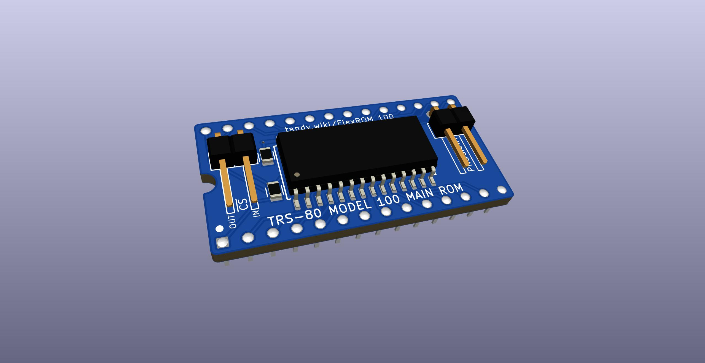  
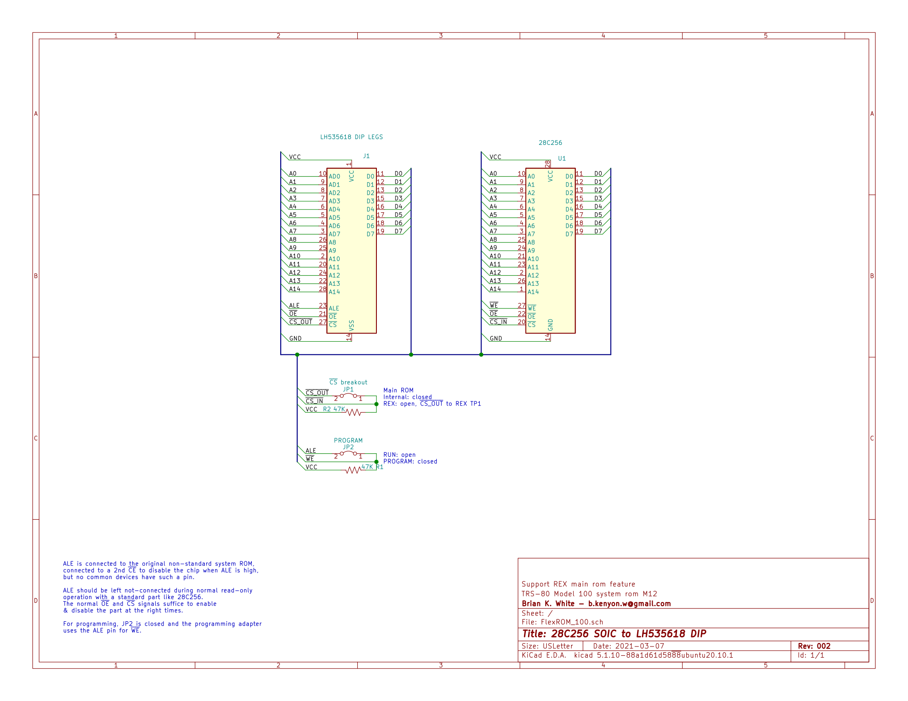  

http://tandy.wiki/FlexROM_100

Uses an electrically re-programmable EEPROM (28C256) in place of the non-standard pinout mask ROM (LH535618) in a TRS-80 Model 100 system rom socket.

Includes /CS signal send-return breakout to use with [REX main rom feature](http://bitchin100.com/wiki/index.php?title=Main_ROM_Management_Feature). This allows not only using the REX main-rom feature but also allows reverting from REX back to the internal main rom without opening the computer again to re-install the original main rom chip. It is especially convenient with [this re-spin version of REX Classic](http://tandy.wiki/Building_a_REX), which has horizontal male pins on TP1 and TP2, which allows using removable female dupont jumper wires between the FlexROM_100 inside the computer and the REX in the option rom compartment.

To program the eeprom, use either the FlexROM_100_programming_adapter, or an SOIC-28 test clip.

To install without REX, install a jumper on the /CS pins.

To use the REX main rom feature:  
* Run 2 10-inch female dupont jumper wires from the /CS pins out to the option-rom compartment.  
* Label the /CS OUT wire so that you can tell which one it is from the option rom compartment after the machine is re-assembled. One suggestion is to use the wire colors to identify the /CS_OUT-TP1 wire. When installing the wires, pick a neutral black, white, or grey wire for the /CS IN wire, and pick any other color for the /CS OUT wire. Then later you only have to remember that "the colored wire is the special one", the colored wire goes on the TP1 pin.  
* Attach the /CS OUT wire to the TP1 pin on the REX.  
* Leave the /CS IN wire un-connected loose in the option rom compartment. It is only used when you want to remove the REX, or just don't want to use the REX's main-rom feature.

To re-enable the internal ROM (To remove the REX, or just to stop using the main-rom feature):  
* Disconnect the /CS OUT wire from the REX TP1 pin.  
* Use a short male dupont jumper wire to join the /CS OUT and /CS IN wires to each other in the option rom compartment.

## FlexROM_100 Programming Adapter
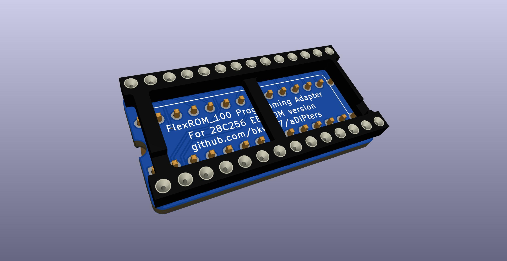  
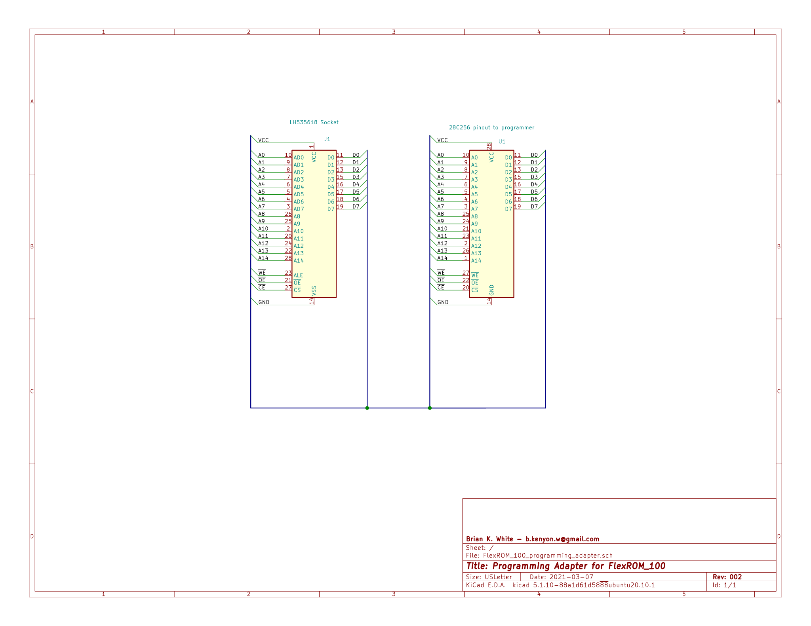  

Allows writing to the FlexROM_100 without a soic-28 test clip.  

## FlashROM_100
Same as FlexROM_100 but using a 29F010 or compatible flash part instead of a 28C256 EEPROM part.  
SST39SF010A, GLS29EE010, etc.

To program the chip, use the FlashROM_100_Programming_Adapter, and tell the programmer to ignore the CHIP_ID and use device 28F256.

There are 2 versions, PLCC and TSOP

### PLCC
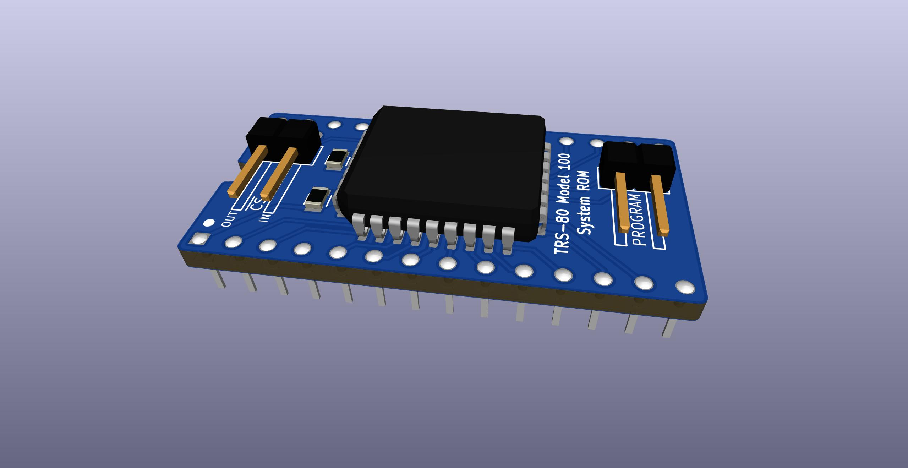  
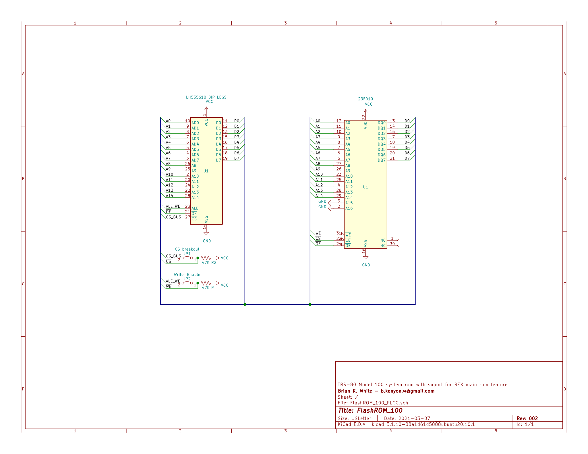  

### TSOP
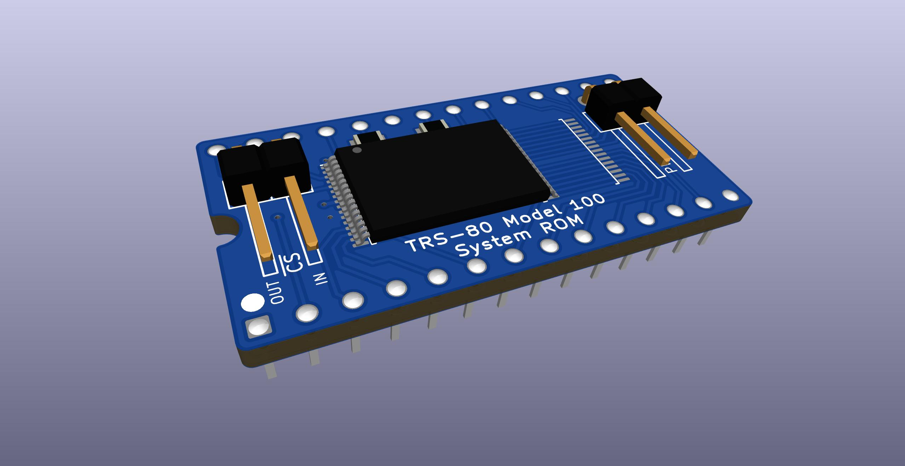  
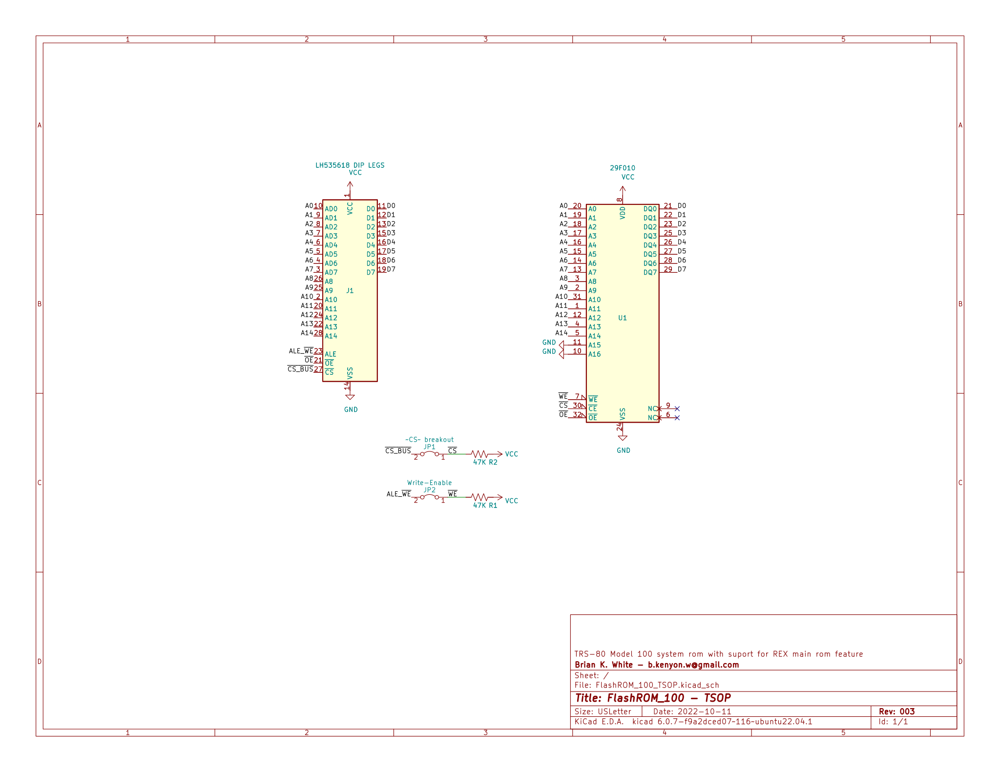  

## FlashROM_100 Programming Adapter
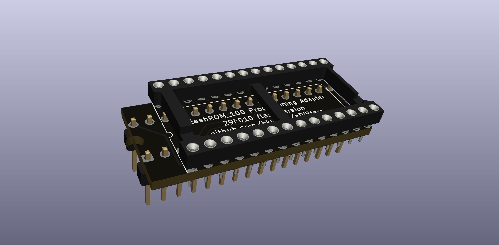  
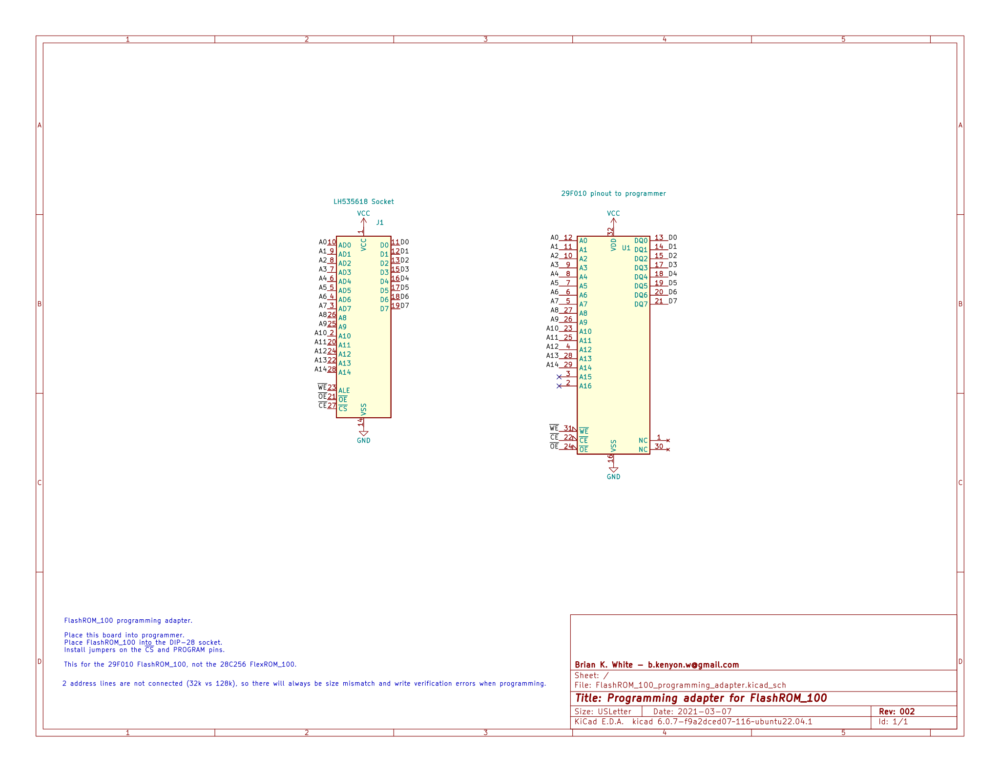  

Allows re-writing the FlashROM_100.

## FlexROM_102
  
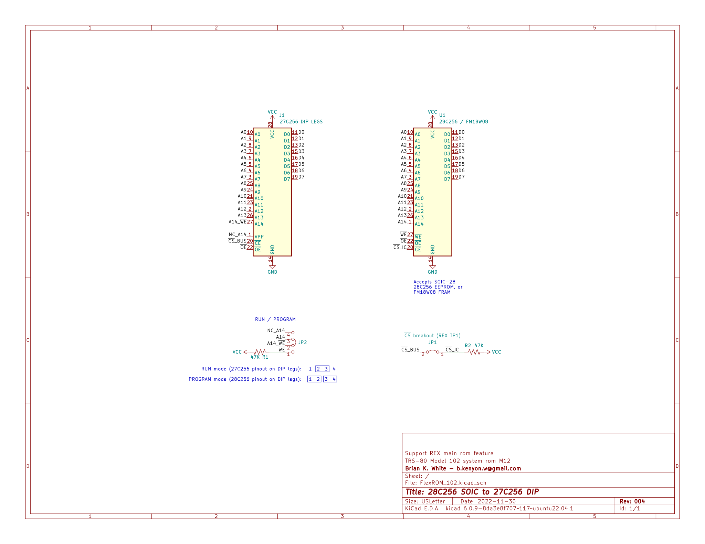  

http://tandy.wiki/FlexROM_102

Same as FlexROM_100, but for Model 102.  
or/also,  
Same as 28C256_to_27C256, with /CS breakout for REX Classic main rom feature.

Uses an electrically re-programmable EEPROM (28C256) in place of the original system rom in a Tandy Model 102.

Provides a breakout or remote loop for the /CS line to use with REX main rom feature. This allows reverting from REX back to the internal main rom without opening the computer again to re-install the original rom.

The Model 102 system ROM is soldered, so to use this requires de-soldering the original chip and installing a DIP-28 socket in it's place.

Since the pinout is standard 27C256 or 256K x 8 mask rom, you could also use the generic 28C256_to_27C256 board above for the main rom in a 102. But if you want to use the REX main rom feature in a Model 102, then this board provides the /CS remote loop to connect to REX's TP1 pin, and allow reverting from REX back to the internal ROM without opening the Model 102 case again to re-install the original main rom chip.

To program the eeprom, set the mini jumpers to PROGRAM (two shunts on the two pairs of pins), put the board in the programmer, and set the programmer for 28C256. There is no separate programming adapter needed like for FlexROM_100 and FlashROM_100.

To install/run, set the mini jumpers to RUN (single shunt on the two center pins), and install in the Model 102 in place of the main rom.

To use the REX main rom feature, run 2 female dupont jumper wires from the /CS OUT and /CD IN pin out to the option-rom compartment. Label the /CS OUT wire. Attach the /CS OUT wire to TP1 on the REX.

To install without REX, install a jumper on the /CS pins.

## FLASH_23C1000
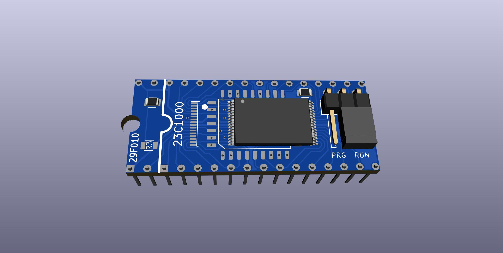  
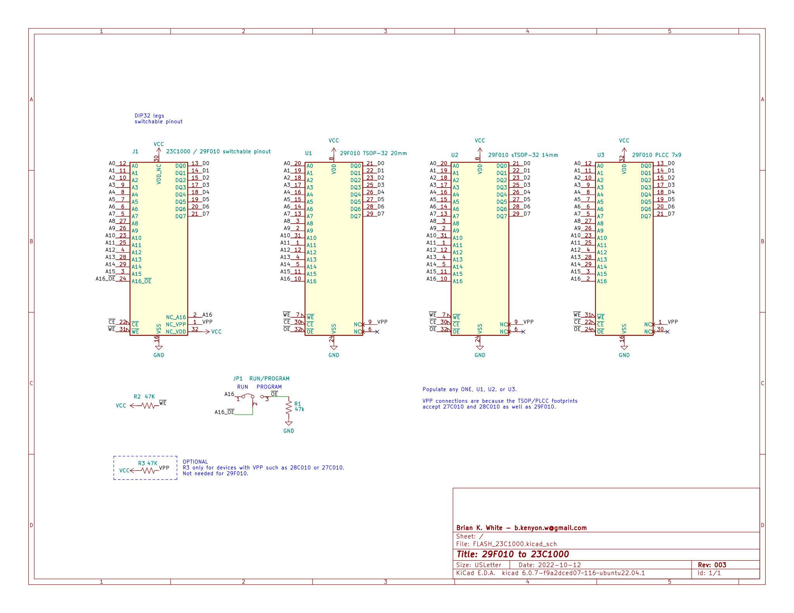  

http://tandy.wiki/FLASH_23C1000

This board uses a variety of writable flash, eeprom, or eprom devices to replace the non-standard pinout 128K mask rom in at least: NEC PC-8300, PC-8401, and PC-8500  
Not tested but should also work in Cambridge Z88

The nominal flash chip is SST39SF010, but there are several other compatible parts. The specs for a compatible chip are:
* 128K x 8  
* 5v  
* parallel  
* 7x9pin PLCC32, or 8x14mm sTSOP32, or 8x20mm TSOP32  

It actually supports EPROM and EEPROM as well as flash parts.  
At least the following parts are compatible:  
* 29F010  
* 39SF010  
* 29SF010  
* 29EE010  
* 28C010  
* 28F010  
* 27SF010  
* 27C010  

The R3 resistor is only needed for EPROM and EEPROM devices that have a Vpp pin (27xxx/28xxx). Flash devices (29xxx) don't use it.

The RUN/PRG jumper alters the pinout, so that the chip may be programmed by placing the board directly in a programmer zif socket.

For programming:  
1. Place the jumper in the PRG position  
1. Place the board in the programmer's zif socket  

For installing in place of the 23C1000:  
1. Place the jumper in the RUN position  
1. Place the board in the socket with the top 4 pins (1, 2, 31, 32) hanging off the pin #1 end of the socket, and the bottom 28 pins 3-30 filling the socket  

For NEC PC-8401, cut pin 1 a little short so that it doesn't touch R65, or use the DIP-28 version of the board, FLASH_23C1000_DIP28.

## FLASH_23C1000_DIP28
  
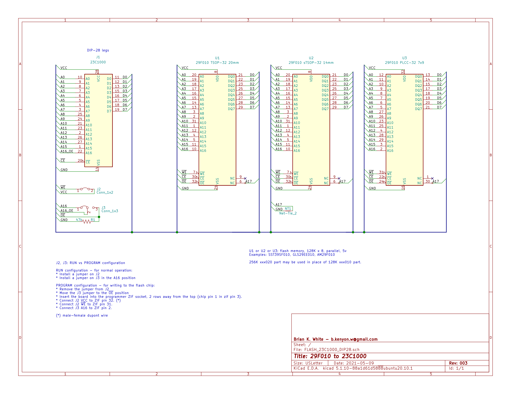  

Same as FLASH_23C1000, except without exceeding the DIP-28 footprint.  
Tested in NEC PC-8300, PC-8401, PC-8500  
Not yet tested but should also work in Cambridge Z88

Programming this version is slightly more complicated. To program this version:
* Place the board in the programmer 2 rows from the top, such that pin 1 on the board is in pin 3 of a virtual DIP-32 in the programmer.
* Remove the VCC-/WE jumper.
* Move the /OE-A16 jumper to /OE
* Connect the A16 pin to programmer DIP-32 pin 2
* Connect the VCC pin to programmer DIP-32 pin 32
* Connect the /WE pin to programmer DIP-32 pin 31

Configure the programmer for whatever device is installed on the board, IE SST39SF010A etc.

To install this version:
* Install a jumper across the VCC-/WE pins
* Move the /OE-A16 jumper to A16
* Install the board in the  DIP-28 socket in place of any uPD23C1000, D23C1000A, MX23C1000 etc.

## TANDY 100/102/200 Option ROM to 27C256 pinout programming adapter
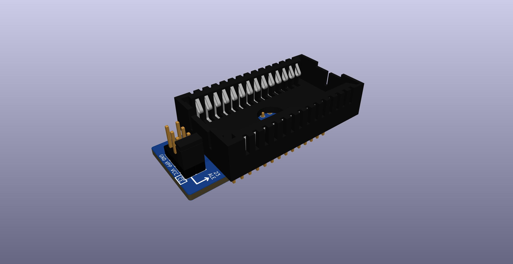  
<!-- 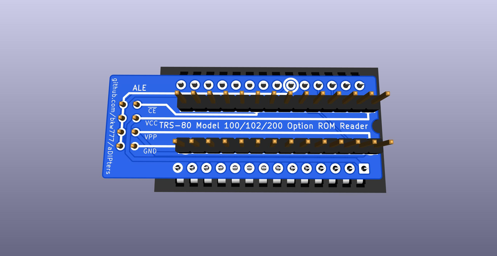  -->
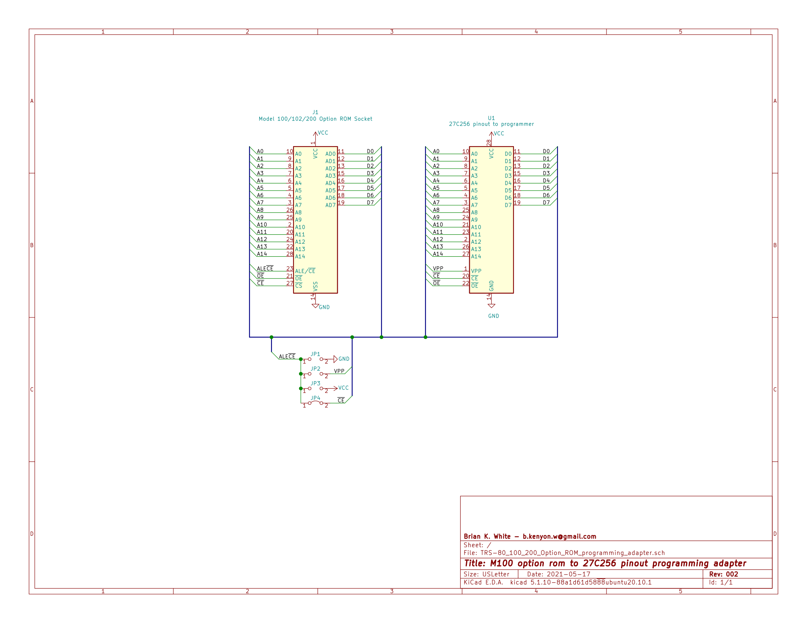

If you have a Molex 78805 socket and are willing to consume it for this, this provides an adapter to allow reading Model 100/200 Option ROMs in an eprom programmer.

The jumpers provide 5 different ways to handle pin #23 in the socket.  
In the Model 100, pin 23 is labelled as a 2nd /CS (aka /CE), but is connected to the ALE bus signal.  
The few option roms that natively have the non-standard Model 100 pinout (MS MultiPLAN, Ineractive Solutions) require pin 23 be connected to /CE.  
Most (all?) other option roms are constructed from a 27C256 in some form of pinout adapter.  
A 27C256 does not have an ALE pin nor a 2nd /CS pin, and does not need pin 23 connected to anything.  
The jumpers allow pin 23 in the Molex socket to be connected to nothing, GND, VCC, VPP, or /CE.  
* For the molded plastic roms with LH53562x part numbers (MS MultiPLAN, Ineractive Solutions), use the /CE position.  
* For most 3rd party roms constructed of a ceramic 27C256 with pinout adapter, use either /CE, or remove the jumper entirely.  
* The other options are for possible future use with other new custom option rom modules like [Teeprom](httpsgithub.com/bkw777/Teeprom) or FlashOPT_100 etc, that might be specifically designed to use that otherwise un-used pin for /Vpp or /WE etc. Currently none are in fact so wired.

## DS1000
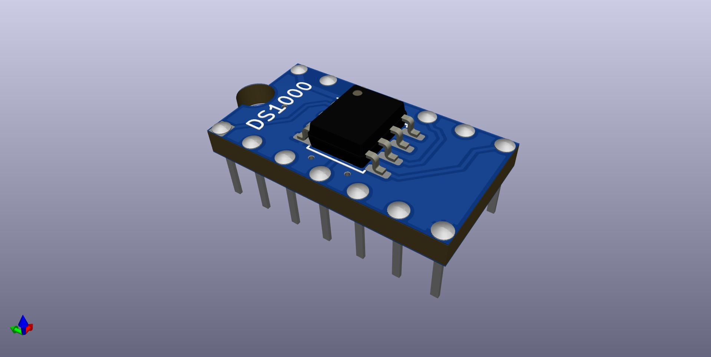
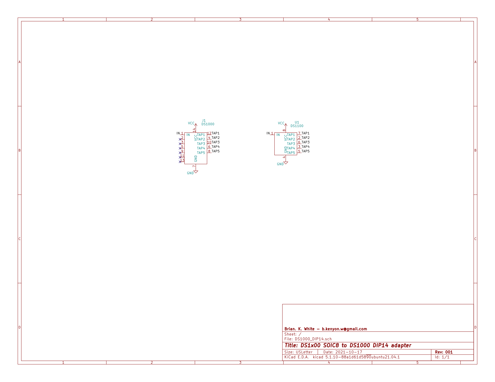

